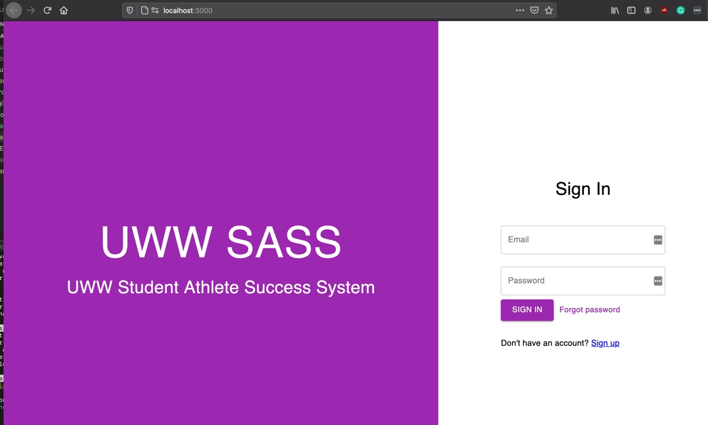
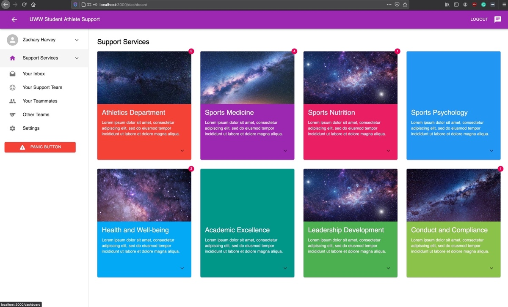
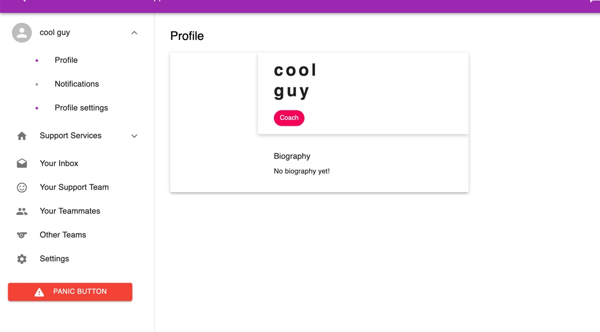

<!--
*** Thanks for checking out the Best-README-Template. If you have a suggestion
*** that would make this better, please fork the repo and create a pull request
*** or simply open an issue with the tag "enhancement".
*** Thanks again! Now go create something AMAZING! :D
***
***
***
*** To avoid retyping too much info. Do a search and replace for the following:
*** uww-student-athlete-success, stuath-success-web, Student Athlete Success, Sample Project description
-->


<!-- PROJECT SHIELDS -->
<!--
*** I'm using markdown "reference style" links for readability.
*** Reference links are enclosed in brackets [ ] instead of parentheses ( ).
*** See the bottom of this document for the declaration of the reference variables
*** for contributors-url, forks-url, etc. This is an optional, concise syntax you may use.
*** https://www.markdownguide.org/basic-syntax/#reference-style-links
-->
[![Contributors][contributors-shield]][contributors-url]
[![Forks][forks-shield]][forks-url]
[![Stargazers][stars-shield]][stars-url]
[![Issues][issues-shield]][issues-url]
<!-- [![MIT License][license-shield]][license-url] -->

<!-- PROJECT LOGO -->
<br />
<p align="center">
  <a href="https://github.com/uww-student-athlete-success/stuath-success-web">
    
  </a>

  <h3 align="center">Student Athlete Success</h3>

  <p align="center">
    UWW SASS is a information/social media support platform for student athletes and coaches.
    <br />
    <a href="https://github.com/uww-student-athlete-success/stuath-success-web"><strong>Explore the docs »</strong></a>
    <br />
    <br />
    <a href="https://github.com/uww-student-athlete-success/stuath-success-web">View Demo</a>
    ·
    <a href="https://github.com/uww-student-athlete-success/stuath-success-web/issues">Report Bug</a>
    ·
    <a href="https://github.com/uww-student-athlete-success/stuath-success-web/issues">Request Feature</a>
  </p>
</p>

<!-- TABLE OF CONTENTS -->
<details open="open">
  <summary><h2 style="display: inline-block">Table of Contents</h2></summary>
  <ol>
    <li>
      <a href="#about-the-project">About The Project</a>
      <ul>
        <li><a href="#built-with">Built With</a></li>
      </ul>
    </li>
    <li>
      <a href="#getting-started">Getting Started</a>
      <ul>
        <li><a href="#prerequisites">Prerequisites</a></li>
        <li><a href="#installation">Installation</a></li>
      </ul>
    </li>
    <li><a href="#usage">Usage</a></li>
    <li><a href="#roadmap">Roadmap</a></li>
    <li><a href="#contributing">Contributing</a></li>
    <li><a href="#license">License</a></li>
    <li><a href="#acknowledgements">Acknowledgements</a></li>
  </ol>
</details>

<!-- ABOUT THE PROJECT -->
## About The Project

The primary goal of the Student Athlete Success application is to make getting 
mental support for student athletes at UW-Whitewater more accessible in a private 
manner. In order to achieve this, the system will be able to:
* Allow easy and instant communication between student athletes, coaches, and support staff from UWW
* Provide an easy and simplified interface for all users, allowing them to access critical resources from one place
* Create a positive environment to allow student athletes to talk about mental health issues and provide an outlet for those suffering from mental health issues

### Built With

* [Bootstrap](https://getbootstrap.com/)
* [MongoDB](https://www.mongodb.com/)
* [NodeJS](https://nodejs.org/en/)
* [React](https://reactjs.org/)
* [Express](https://expressjs.com/)

<!-- GETTING STARTED -->
## Getting Started

To get a local copy up and running follow these simple steps.

### Prerequisites

UWW SASS requires [Node.js](https://nodejs.org/) v10+ to run.
UWW SASS requires a backend server and a front end server

### Installation

To start the Client
1. Clone the repo
   ```sh
   git clone https://github.com/uww-student-athlete-success/stuath-success-web.git
   ```
2. Install NPM packages
   ```sh
   npm install
   ```
3. Start yan
   ```sh
   yarn
   ```
4. Start Server
   ```sh
   npm start
   ```

Once this is completed a window should pop up in your browser. This is the frontend. If you get an error, change the version of ```"react-scripts":``` to  ```"3.4.1"```.

To start the Server
1. Ensure you have the most up-to-date config.json file. This will allow you to connect to the database
2. Open a separate commandline
3. Navigate to the project's root directory
4. Run
   ```sh
   yarn server
   ```

The backend server will then start, if you connect to the database properly the command line will say so. Once that is done, the installation is complete.

<!-- USAGE EXAMPLES -->
## Usage

### Additional Screenshots




_For more examples, please refer to the [Documentation](https://example.com)_

<!-- ROADMAP -->
## Roadmap

See the [open issues](https://github.com/uww-student-athlete-success/stuath-success-web/issues) for a list of proposed features (and known issues).

<!-- LICENSE -->
## License

<!-- Distributed under the MIT License. See `LICENSE` for more information. -->

<!-- ACKNOWLEDGEMENTS -->
## Acknowledgements
* All stuath-success-web - Software Engineering students working on this project

<!-- MARKDOWN LINKS & IMAGES -->
<!-- https://www.markdownguide.org/basic-syntax/#reference-style-links -->
[contributors-shield]: https://img.shields.io/github/contributors/uww-student-athlete-success/repo.svg?style=for-the-badge
[contributors-url]: https://github.com/uww-student-athlete-success/repo/graphs/contributors
[forks-shield]: https://img.shields.io/github/forks/uww-student-athlete-success/repo.svg?style=for-the-badge
[forks-url]: https://github.com/uww-student-athlete-success/repo/network/members
[stars-shield]: https://img.shields.io/github/stars/uww-student-athlete-success/repo.svg?style=for-the-badge
[stars-url]: https://github.com/uww-student-athlete-success/repo/stargazers
[issues-shield]: https://img.shields.io/github/issues/uww-student-athlete-success/repo.svg?style=for-the-badge
[issues-url]: https://github.com/uww-student-athlete-success/repo/issues
<!-- [license-shield]: https://img.shields.io/github/license/uww-student-athlete-success/repo.svg?style=for-the-badge
[license-url]: https://github.com/uww-student-athlete-success/repo/blob/master/LICENSE.txt -->